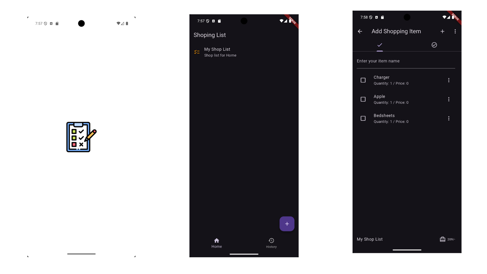

# Local Shopping List


## Overview

Local Shopping List is a Flutter-based application designed to help users manage and organize their shopping lists efficiently. With a user-friendly interface and seamless cross-platform functionality, it ensures you never miss an item during your shopping trips.

## Features

- **Add Items**: Quickly add items to your shopping list with a simple input.
- **Edit & Delete**: Modify item details or remove them as needed.
- **Cross-Platform**: Consistent experience across Android, iOS, web, and desktop platforms. (Web and desktop) comeing soone

## Screenshots



## Getting Started


### Installation

1. **Clone the Repository**:

   ```bash
   git clone https://github.com/girish54321/local-shoping-list.git
   cd local-shoping-list
